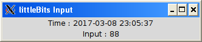
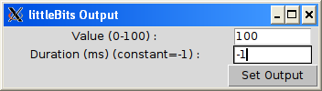

# cloudbit_2_py
Python examples of how to connect to the (littleBits) Cloudbit REST API

The project contains the following examples:

* __lb_input.py__ - basic read Cloudbit input value
* __lb_tk_input.py__ - Tkinter read Cloudbit input value every 2 seconds
* __lb_tk_output.py__ - Tkinter set Cloudbit output value

## lb_input.py - basic read Cloudbit input value

The Cloudbit input value REST API is a streaming value, this can be a problem if the application is only expecting a single value. To simply get only a single data value a **break** can be used after reading the first line. A simple example to read only a single value is shown below.

```python
#
# lb_input.py - read input from a Cloudbit device
#
import json
import requests


requests.packages.urllib3.disable_warnings()

# Change with your Authorization code and deviceID
authToken = "4f3830b44e1d4b27xxxxxx"
deviceId = "00e04c0379bb"

littleBitsUrl = "https://api-http.littlebitscloud.cc/devices/" + deviceId + "/input"

headers = {"Authorization": "Bearer " + authToken,"Content-type": "application/json"}
r = requests.get(littleBitsUrl, headers=headers, stream=True)

for line in r.iter_lines():
    if "StatusCode" in line:
        # there is an error
        print line
    else:
        # parse the response to get the JSON data
        result = json.loads(line.split('data:')[1])
        print "percent   : ", result['percent']
    break
```

## lb_tk_input.py - Tkinter read Cloudbit input value every 2 seconds



Below is a Tkinter example that reads the Cloudbit input value every 2 seconds.
```python
#
# lb_tk_input.py
#
from Tkinter import *
import json
import requests
import datetime, time

requests.packages.urllib3.disable_warnings()

# update your auth Token and device ID
authToken = "4f3830b44e1d4b27xxxx"
deviceId = "00e04c0379bb"

littleBitsUrl = "https://api-http.littlebitscloud.cc/devices/" + deviceId + "/input"

headers = {"Authorization": "Bearer " + authToken, "Accept": "application/vnd.littlebits.v2+json"}

def getvalue():
    r = requests.get(littleBitsUrl, headers=headers, stream=True)
    for line in r.iter_lines():
        print line
        # Parse the line, get the results, then break
        result = json.loads(line.split('data:')[1])
        thevalue = result['percent']
        lb_value['text']="Input : " + str(thevalue) 
        thetime = datetime.datetime.fromtimestamp(result['timestamp']/1000)
        lb_time['text'] = "Time : " + str(thetime.date()) + " " + str(thetime.time())
        root.update()
        break

root = Tk()
root.title('littleBits Input')

lb_value = Label(root, text="Input : ", width= 40)
lb_value.pack(side = BOTTOM)
lb_time = Label(root, text= "Time : ")
lb_time.pack(side = BOTTOM)

while True:
	getvalue()
	time.sleep(2)
```

## lb_tk_output.py - Tkinter set Cloudbit output value



The Cloudbit REST API expects a JSON formatted parameters for the value and the time duration. Below is a Tkinter example that will allow a value between 0-100 to be set. Also the duration of the output can be specified (in milliseconds). A constant output is set by passing a -1.
```python
#
# lb_tk_output.py
#
from Tkinter import *
import json
import requests

# update your auth Token and device ID
authToken = "4f3830b44e1d4b27xxxx"
deviceId = "00e04c0379bb"

littleBitsUrl = "https://api-http.littlebitscloud.cc/devices/" + deviceId + "/output"

headers = {"Authorization": "Bearer " + authToken, "Content-type": "application/json"}

def setvalue():
	thevalue = lb_value.get()
	thetime = lb_duration.get()
	body = {"percent": thevalue , "duration_ms": thetime}
	thebody = json.dumps(body)
	print body, thebody
	#r = requests.post(littleBitsUrl,  data=body, headers=headers)
	r = requests.post(littleBitsUrl,  data=thebody, headers=headers)
	print r
     

root = Tk()
root.title('littleBits Output')

Label(text = "Value (0-100) :",width=30).grid(row=0,column=0)
lb_value = Entry(root, width= 10)
lb_value.grid(row=0,column=1)
Label(text = "Duration (ms) (constant=-1) :",width=30).grid(row=1,column=0)
lb_duration = Entry(root, width= 10)
lb_duration.grid(row=1,column=1)


Button(root, text=' Set Output ', bg='silver', command=setvalue).grid(row=2,column=1)

root.mainloop()

```


